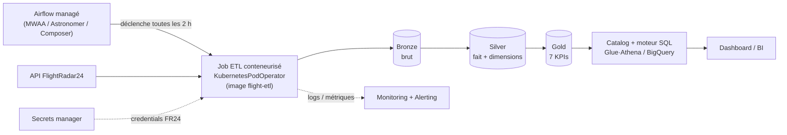

# Pipeline ETL — Trafic Aérien Mondial

Pipeline **ETL batch** (Apache Spark) qui
- 1 . collecte le trafic aérien mondial via l'API
**FlightRadar24**,
- 2 . l'enrichit dans une architecture **Medallion** (Bronze → Silver → Gold),
- 3 . calcule **7 KPIs** et
- 4 . les expose dans un **dashboard Streamlit**
- 5 . orchestré **toutes les 2 heures** par **Apache Airflow**
- 6 . tout conteneurisé via Docker

**Les 7 KPIs** :
(1) compagnie la plus active
(2) top compagnie régionale par continent
(3) vol en cours le plus long
(4) distance moyenne par continent
(5) constructeur le plus actif
(6) top 3 modèles d'avion par pays
(7, bonus) aéroport au plus grand écart départs/arrivées.

```
API FlightRadar24 ──► BRONZE (brut) ──► SILVER (fact_flights + 4 dimensions) ──► GOLD (7 KPIs) ──► Dashboard
                       partition year/month/day/hour (3 couches)
```

## Architecture

Quatre rôles séparés ; tout communique par un **volume partagé** (`flight_datalake`) :

```
   ┌──────────────┐  déclenche toutes les 2 h (DockerOperator)
   │   Airflow    │ ─────────────────────────────┐
   │   :8080      │  ordonnancement & supervision │
   └──────────────┘                               ▼
                                        ┌────────────────────┐
   API FlightRadar24 ──────────────────►│  flight-etl (job)  │  run_batch (Spark)
                                        │  conteneur isolé   │
                                        └─────────┬──────────┘
                                                  │ écrit Parquet + métriques JSON
                                                  ▼
                       volume   ┌──────────────────────────────────────┐
                     flight_    │  BRONZE → SILVER → GOLD  + _logs/      │
                     datalake   │                          _reference/  │
                                └───────────────────┬───────────────────┘
                                                    │ lit (pandas/pyarrow)
                                                    ▼
                                          ┌────────────────────┐
                                          │  Dashboard         │  KPIs + statut des runs
                                          │  Streamlit :8501   │
                                          └────────────────────┘
```

| Rôle | Composant | Détail |
|---|---|---|
| **Ordonnancement** | Airflow (DAG `flight_etl_pipeline`) | toutes les 2 h, retries, supervision ; déclenche le job via DockerOperator |
| **Exécution** | conteneur `flight-etl` | `run_batch` : extraction → validation → Bronze → Silver → Gold (Spark local) |
| **Stockage** | volume `flight_datalake` | Medallion Parquet partitionné + `_logs/` (métriques) + `_reference/` (jeu aéroports) |
| **Visualisation** | dashboard Streamlit | KPIs (Gold) + suivi des runs en direct, lit le même volume |

## Architecture cible (production)

L'implémentation locale (Docker + Airflow) est un **fidèle réduit** de l'architecture de prod
visée. En cloud, on garde la même chaîne — orchestration / exécution isolée / Medallion / exposition
— mais portée par des services managés :



**Correspondance local ↔ production** (chaque brique a son équivalent prod) :

| Brique locale (ce repo) | Cible production |
|---|---|
| Image Docker `flight-etl` | Même image, déployée sur **Kubernetes** (GKE) |
| Airflow standalone + Postgres | **Airflow managé** (Composer) |
| `DockerOperator` | **`KubernetesPodOperator`** (même DAG, isolation par pod) |
| Volume `flight_datalake` | **Object storage** S3/GCS — lifecycle policy = rétention |
| Lecture Parquet pandas (dashboard) | **Catalog + moteur SQL** (Glue+Athena, BigQuery) + BI |
| `.env` / variables | **Secrets manager** (Vault, AWS/GCP Secrets) |
| Logs fichiers + `JobMetrics` | **Observabilité** (CloudWatch) + alerting |

Le code métier (extraction, cleaning, KPIs, partitionnement `tech_*`) est **identique** : seul
l'environnement d'exécution change. Passer à l'échelle = changer `SPARK_MASTER` (cluster) + lire/
écrire sur l'object storage — **sans réécriture de la logique**.

## Choix techniques & justifications

Chaque décision structurante répond à un besoin du sujet (batch toutes les 2 h, scalabilité,
tolérance aux pannes, anti-quota API) ou à une contrainte de fiabilité/sécurité :

| Choix | Justification |
|---|---|
| **Spark Core (batch, pas streaming)** | Scalabilité + tolérance aux pannes ; le besoin est un batch ponctuel toutes les 2 h, pas un flux continu |
| **Architecture Medallion (Bronze → Silver → Gold)** | Traçabilité, découplage des étapes, **Bronze rejouable** → on recalcule Silver/Gold sans re-collecter l'API |
| **Parquet + partition temporelle `year/month/day/hour`** | Columnar compressé, schéma fort, **partition pruning** à la lecture, rétention/purge triviales |
| **Star schema (fait `fact_flights` + dimensions)** | Réutilisabilité, audit, séparation claire fait / dimensions |
| **Airflow orchestre, n'exécute pas (DockerOperator)** | Image Airflow légère ; le job tourne **isolé** dans un conteneur `flight-etl` (équivalent local du `KubernetesPodOperator` — voir section *Architecture cible*) |
| **Postgres + LocalExecutor (vs SQLite)** | Évite le verrou SQLite sous la charge du scheduler ; déploiement minimal (2 conteneurs) mais fiable |
| **Enrichissement par dimensions *bulk* (vs `get_flight_details` par vol)** | Anti-quota / anti-rate-limit : 1 appel groupé au lieu de N appels (N = nb de vols) |
| **Jeu aéroports statique OpenFlights (auto-téléchargé/rafraîchi)** | Fiabilité, **zéro quota API**, résultats reproductibles ; TTL de rafraîchissement configurable |
| **Image Docker unique `flight-etl` (réutilisée par `etl` + `dashboard`)** | Simplicité, une seule build, pas de double construction concurrente du même tag |
| **Idempotence (overwrite par partition + dédup `flight_id`)** | Re-run de la même heure = remplacement, jamais d'empilement ; **validé par un test de double run** |
| **Sécurité du socket Docker via `docker-socket-proxy`** | Airflow exécute du code DAG arbitraire : un proxy filtrant (réseau interne, non-root, API minimale) neutralise la faille classique du `docker.sock` — détail en section *Orchestration Airflow* |

## Structure du projet

```
├── src/                      # cœur du pipeline
│   ├── batch_job.py          #   point d'entrée unique (run_batch : 7 phases)
│   ├── flight_extraction.py  #   collecte API (zones, dédup, login/retry)
│   ├── dimension_loader.py   #   dimensions + jeu aéroports auto-géré (download/refresh)
│   ├── transformations.py    #   nettoyage, enrichissement, 7 KPIs
│   ├── silver_gold_loader.py #   orchestration Bronze → Silver → Gold
│   ├── data_quality.py       #   8 flags qualité + is_valid
│   ├── schemas.py            #   schémas Spark (Bronze/Silver/Gold)
│   ├── reference_data.py     #   pays→continent, avion→constructeur
│   ├── job_metrics.py        #   métriques d'exécution (JSON)
│   ├── alerting.py           #   alertes (fichier/log/webhook)
│   └── datalake_utils.py     #   valeurs de partitionnement horodatées
├── config/                   # pipeline_config.py (config centralisée)
├── scripts/                  # run_job.py, init_datalake.py
├── airflow/                  # orchestration : Dockerfile + dags/flight_etl_dag.py (toutes les 2 h)
├── Dockerfile                # image flight-etl (JDK 17 + Python 3.11 + deps + code)
├── docker-compose.yml        # services etl + dashboard (+ profil airflow : postgres + airflow)
├── .dockerignore             # (et .env.example pour surcharges/secrets)
├── tests/                    # unit / integration / e2e (~80 tests)
├── data/airports.dat         # référentiel aéroports OpenFlights (téléchargé au 1er run, non commité)
├── datalake/                 # bronze/ silver/ gold/ _logs/  (généré)
├── dashboard.py              # dashboard Streamlit (statut run + KPIs + métriques)
├── documentation/
│   └── DOCUMENTATION.md       # documentation technique complète
└── premiere_exploration/     # notebook de découverte de l'API
```

## 🐳 Démarrage rapide avec Docker (recommandé)

Aucun prérequis hormis **Docker Desktop** — ni Java, ni Python, ni winutils à installer. Une
seule commande :

```bash
docker compose up        # build l'image, lance le batch ETL + le dashboard
```

- Dashboard : **http://localhost:8501** (suivez le run en direct via l'onglet « Statut d'exécution »).
- Le service `etl` exécute un batch complet (Bronze → Silver → Gold) puis sort ; les données
  persistent dans le volume `datalake`.
- Relancer un batch plus tard : `docker compose run --rm etl`.
- (Optionnel) `cp .env.example .env` pour des identifiants FR24 ou ajuster la mémoire Spark.

## 🗓️ Orchestration Airflow (toutes les 2 h)

Le DAG planifie le batch (`0 */2 * * *`) dans le conteneur `flight-etl` isolé.
*Le moteur Docker Desktop **doit** être actif.*

```bash
docker compose build                         # image flight-etl
docker compose --profile airflow up -d       # Airflow (:8080) + dashboard (:8501)
```

- **Airflow** : http://localhost:8080 — identifiants **`admin` / `admin`** (simplicité en dev ;
  sinon `docker compose logs airflow | grep -i password`). DAG `flight_etl_pipeline`.
- **Dashboard** : http://localhost:8501 — chaque run planifié (onglet « Statut d'exécution »)
  et les KPIs rafraîchis (onglet « KPIs (Gold) »).
- **Sécurité** : Airflow ne monte pas le socket Docker et tourne en non-root ; il pilote le
  `DockerOperator` via un proxy filtrant (`docker-socket-proxy`, réseau interne) qui n'expose que
  l'API strictement nécessaire — neutralisant la faille classique du `docker.sock`.
- Déclencher un run à la demande :
  `docker compose exec airflow airflow dags trigger flight_etl_pipeline`.
- Suivre les logs : `docker compose logs -f airflow` (ou `etl`, `dashboard`).
- Arrêter (données conservées) : `docker compose --profile airflow down` ·
  tout réinitialiser (efface les volumes) : `docker compose --profile airflow down -v`.

## Démarrage rapide (natif, sans Docker)

```bash
pip install -r requirements.txt                   # Python 3.9–3.11 + un JDK (8/11/17) requis
python scripts/init_datalake.py
python scripts/run_job.py --with-silver-gold     # 1 batch : Bronze → Silver → Gold
streamlit run dashboard.py                        # KPIs : http://localhost:8501
pytest -m "not slow and not e2e" -q               # tests
```

> **Windows** — l'écriture Parquet exige `winutils.exe`/`hadoop.dll` : placez-les dans
> `%USERPROFILE%\hadoop\bin` et `HADOOP_HOME` est **auto-détecté** (comme `PYSPARK_PYTHON`).
> Voir [DOCUMENTATION.md § 6](documentation/DOCUMENTATION.md#6-exécution--exploitation).
> *(Docker évite ce prérequis entièrement.)*

## Documentation

Toute la documentation technique est dans **[documentation/DOCUMENTATION.md](documentation/DOCUMENTATION.md)** :

| Pour… | Section |
|---|---|
| Comprendre l'architecture & les choix | [§1 Vue d'ensemble](documentation/DOCUMENTATION.md#1-vue-densemble) |
| Le modèle de données & les KPIs | [§2 Modèle de données](documentation/DOCUMENTATION.md#2-modèle-de-données) |
| Le datalake & le partitionnement | [§3 Datalake & partitionnement](documentation/DOCUMENTATION.md#3-datalake--partitionnement) |
| Le déroulé du pipeline | [§4 Pipeline ETL](documentation/DOCUMENTATION.md#4-pipeline-etl) |
| L'API & la gestion du quota | [§5 Collecte API & anti-quota](documentation/DOCUMENTATION.md#5-collecte-api--anti-quota) |
| Lancer / planifier / configurer | [§6 Exécution & exploitation](documentation/DOCUMENTATION.md#6-exécution--exploitation) |
| Le dashboard & le monitoring | [§7 Monitoring & Dashboard](documentation/DOCUMENTATION.md#7-monitoring--dashboard) |
| Les tests | [§8 Tests](documentation/DOCUMENTATION.md#8-tests) |
